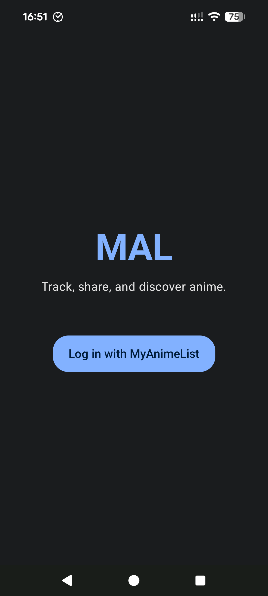
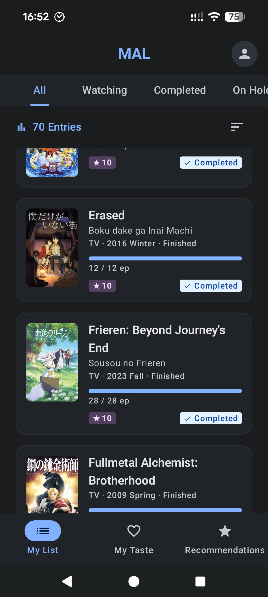
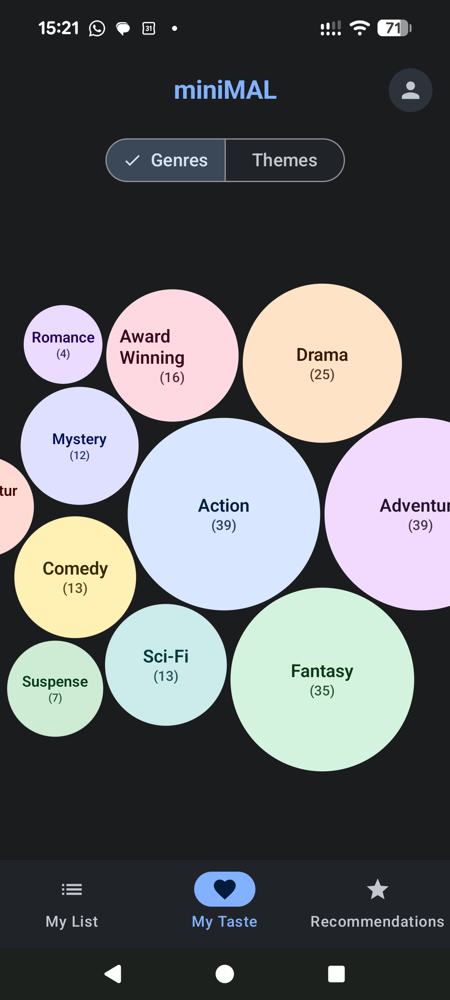
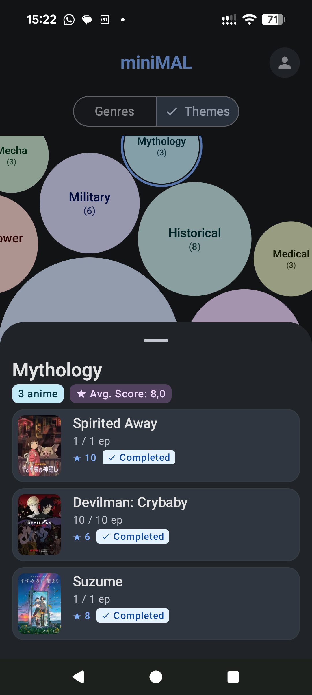

# MyAnimeList (MAL) Android Client

A modern, reactive Android client for the [MyAnimeList API](https://myanimelist.net/apiconfig/references/api/v2). Built with **Clean Architecture**, **MVI unidirectional data flow**, **Jetpack Compose**, and **Material 3**, demonstrating production-grade Android engineering principles.

---

## Screenshots

The screenshots below showcase the application flow, from authentication to anime tracking and visual taste analytics:

| 1. Authentication | 2. My Anime List | 3. Taste Analytics | 4. Taste Drill-down |
| :---: | :---: | :---: | :---: |
|  |  |  |  |

---

## Features

*   **OAuth 2.0 Authentication (PKCE)**: Secure, web-based authentication using Chrome Custom Tabs with high-entropy PKCE code verifiers and CSRF state validation. Transparent token refresh is handled automatically via an OkHttp `Authenticator`.
*   **My Anime List (Offline-First)**: Complete catalog of user anime entries grouped by status (*All*, *Watching*, *Completed*, *On-Hold*, *Dropped*, *Plan to Watch*). Includes real-time progress indicators, rating badges, pull-to-refresh sync, and flexible sorting.
*   **Interactive Taste Analytics**: Dynamic physics-packed bubble chart visualizing the user's top genres and themes based on occurrences in their personal anime list. Features smooth multi-touch gestures (zoom bounds: 0.6x–3.5x, pan), category toggle pills, and recenter controls.
*   **Granular Taste Drill-Down**: Interactive bottom sheet displaying genre/theme statistics, average user rating, and individual anime cards with quick-reference status tags.
*   **Smart Recommendation Engine**: Background-scheduled `WorkManager` engine that evaluates top seasonal and all-time anime against the user's genre preference profile to generate personalized suggestions.
*   **Anime Details**: Rich detail views featuring episode counts, synopsis, seasonal air dates, genres, and production metadata.

---

## Tech Stack

*   **Language**: [Kotlin](https://kotlinlang.org/) (Coroutines, Flow, StateFlow, Channels)
*   **UI Toolkit**: [Jetpack Compose](https://developer.android.com/jetpack/compose) & [Material 3](https://m3.material.io/) ("Soft & Modern" design language)
*   **Architecture**: Clean Architecture & MVI (Model-View-Intent)
*   **Dependency Injection**: [Hilt](https://dagger.dev/hilt/)
*   **Local Persistence**: [Room Database](https://developer.android.com/training/data-storage/room) & [Jetpack DataStore](https://developer.android.com/topic/libraries/architecture/datastore) (Google Tink AEAD encryption)
*   **Networking**: [Retrofit 2](https://square.github.io/retrofit/) & [OkHttp 4](https://square.github.io/okhttp/)
*   **Serialization**: [Kotlinx Serialization](https://github.com/Kotlin/kotlinx.serialization)
*   **Navigation**: Jetpack Navigation Compose with type-safe route serialization
*   **Image Loading**: [Coil 3](https://coil-kt.github.io/coil/)
*   **Background Processing**: [WorkManager](https://developer.android.com/topic/libraries/architecture/workmanager)

---

## Modular Architecture

The project enforces a **Feature-based Multi-Module** architecture to establish clear separation of concerns, improve build caching, and guarantee scalability:

```
├── app/                        # Application entry point, Hilt root, and NavHost
├── core/
│   ├── network/                # Retrofit API services, OkHttp client, Token Authenticator
│   ├── database/               # Room database, DAOs, and database entities
│   ├── datastore/              # Encrypted token storage and user preferences
│   ├── domain/                 # Core domain models, shared Result/Resource wrappers
│   └── ui/                     # Design tokens, theme, typography, shapes, StandardPreviews
└── feature/
    ├── auth/                   # OAuth 2.0 PKCE login and deep link redirect handling
    ├── mylist/                 # Anime catalog, status filtering, and local caching
    ├── taste/                  # Packed bubble chart analytics and bottom sheet drill-down
    ├── recommendation/         # Background recommendation engine and suggestions UI
    └── details/                # Detailed anime views and metadata presentation
```

---

## Engineering Standards & Code Quality

*   **Static Analysis**: [Detekt](https://detekt.dev/) with zero-violation enforcement, 100-character line limit, and strict complexity checks.
*   **Formatting**: [KtLint](https://pinterest.github.io/ktlint/) for idiomatic Kotlin style.
*   **Accessibility (a11y)**: Full TalkBack support across all screens, including custom `Canvas` graphics equipped with virtual semantics nodes, `customActions`, and localized Android plural resources (`<plurals>`).
*   **Testing**: Comprehensive unit test suite covering Domain Use Cases, Data Mappers, and ViewModels using `kotlinx-coroutines-test`, MockK, and in-memory test fakes.
*   **Zero Framework Leakage**: Pure Kotlin Domain layer with zero dependencies on Android framework classes.

---

## Getting Started

### Prerequisites
*   Android Studio Ladybug (2024.2.1) or newer
*   JDK 17
*   Android SDK 35 (`minSdk = 24`, `targetSdk = 35`)

### Configuration

#### 1. MyAnimeList API Client ID
1. Register an application on the [MyAnimeList API portal](https://myanimelist.net/apiconfig) to obtain a Client ID.
2. Add your Client ID to your root `local.properties` file:
   ```properties
   MAL_CLIENT_ID=your_client_id_here
   ```

#### 2. Firebase & Crashlytics Setup (Optional)
This repository is configured with **Graceful Degradation**:
* **Running without Firebase**: If `app/google-services.json` is missing, the app builds and runs normally with Firebase plugins disabled. Unclassified tags and debug logs will be directed to local Logcat via Timber.
* **Running with Firebase**:
  1. Create a Firebase project on the [Firebase Console](https://console.firebase.google.com/).
  2. Add an Android app with package name `com.gokova.myanimelist`.
  3. Download `google-services.json` and place it in the `app/` folder.
  4. Build the app—Firebase Crashlytics will automatically be activated for release builds.

#### 3. Release Keystore Signing (Optional)
By default, release builds fall back to signing with the debug keystore. To sign with a dedicated keystore, configure your `local.properties`:
```properties
RELEASE_KEYSTORE_PATH=release.keystore
RELEASE_KEYSTORE_PASSWORD=your_keystore_password
RELEASE_KEY_ALIAS=your_key_alias
RELEASE_KEY_PASSWORD=your_key_password
```

---

### Verification & Testing
Run the following Gradle commands to verify code quality and execute tests:

```bash
# Run unit tests
./gradlew test

# Run static analysis
./gradlew detekt

# Check Kotlin code formatting
./gradlew ktlintCheck

# Build debug APK
./gradlew assembleDebug

# Build and sign release APK
./gradlew assembleRelease
```

---

## Documentation

All architectural decisions, design tokens, and feature specifications are maintained within the `docs/` directory:

*   [Architecture & Developer Guidelines](docs/AGENTS.md) — Core architectural principles, layer boundaries, testing, and engineering rules.
*   [Design System](docs/DESIGN.md) — Color palettes, typography hierarchies, component tokens, and accessibility standards.
*   **Feature Specifications** (located in `docs/`):
    *   [01: Authentication (OAuth 2.0 & PKCE)](docs/01_authentication.md)
    *   [02: My List & Sync](docs/02_my_list_sync.md)
    *   [03: Taste Analytics (Packed Bubble Chart)](docs/03_taste_screen.md)
