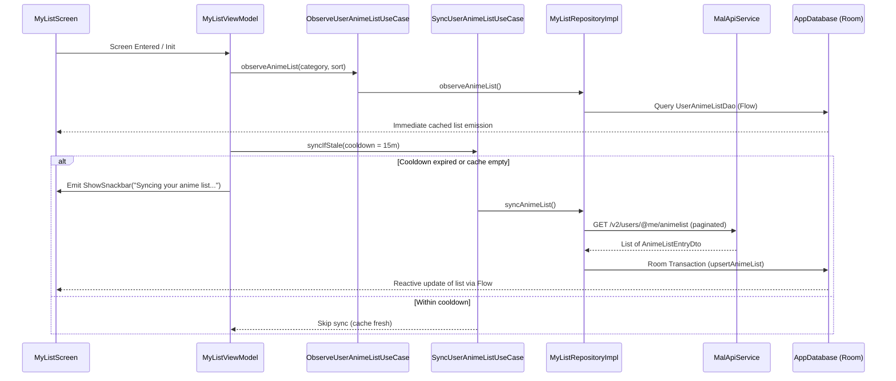

# Feature 02: My List & Synchronization

## Overview
This feature implements the "My List" screen and background synchronization engine. It displays the user's personal anime list with an offline-first architecture powered by AndroidX Room, background API synchronization with rate-limiting and pagination, and a "Soft & Modern" Jetpack Compose interface matching `docs/DESIGN.md`.

---

## Key Requirements & Agreed Design

1. **Offline-First Architecture**:
   - Immediate Room database emission on screen launch so cached data is shown instantly.
   - UI states are never blocked by synchronization.

2. **Synchronization Strategy**:
   - **Trigger**: Stale-while-revalidate with a 15-minute cooldown. Sync triggers when the user enters the My List screen if > 15 minutes have elapsed since the last sync.
   - **Manual Refresh**: Pull-to-refresh support allows the user to force an immediate sync at any time.
   - **Pagination**: Fetch all user anime entries via `GET /v2/users/@me/animelist` using a page size of `500` until `paging.next` is null.
   - **Atomic DB Update**: All fetched entries are persisted in Room within a single transaction to ensure consistency across all categories.
   - **Feedback**:
     - Non-blocking "Syncing your anime list..." snackbar when a sync starts.
     - Silent reactive UI update via Room `Flow` on completion.
     - Informative error snackbar ("Sync failed: showing cached data") with a "Retry" action on failure.

3. **Database Architecture (`:core:database`)**:
   - **Normalized Schema**:
     - `AnimeEntity`: Global anime catalog metadata (`id`, `title`, `titleEnglish`, `mainPictureMedium`, `mainPictureLarge`, `mediaType`, `airingStatus`, `numEpisodes`, `startSeasonYear`, `startSeasonSeason`, `meanScore`).
     - `UserAnimeListEntity`: User tracking metadata (`animeId` referencing `AnimeEntity(id)`, `status`, `score`, `numEpisodesWatched`, `updatedAt`, `isRewatching`).
   - `UserAnimeListItem`: Room relation/embedded data class linking `AnimeEntity` and `UserAnimeListEntity`.

4. **UI & Presentation (`:feature:mylist`)**:
   - **Design System Compliance**: Strict adherence to `docs/DESIGN.md` (Soft & Modern, Pastel Blue theme, rounded shapes, semantic status tokens).
   - **Localization**:
     - Display the English title (`titleEnglish`) as the primary title.
     - If the original/romaji title differs, show it as a secondary subtitle in `onSurfaceVariant`.
   - **Category Tabs**: Top scrollable tabs for "All", "Watching", "Completed", "On Hold", "Dropped", and "Plan to Watch".
   - **Header & Sorting**: Below the tabs, an entry count (e.g. "70 Entries") paired with a sorting menu (Score, Title, Last Updated).
   - **Anime Card**:
     - Poster thumbnail (`2:3` aspect ratio, `8.dp` corner radius, loaded via Coil `AsyncImage`).
     - Airing status, media format, and release season tags.
     - Score badge with star icon (e.g. `★ 9`).
     - Episode progress bar (`195 / ?? ep` or `26 / 26 ep`).
     - Semantic status chip (Watching `#E8F5E9` / `#1B5E20`, Completed `#E3F2FD` / `#0D47A1`, etc.) displayed on all cards.
     - No pen or plus edit buttons (out of scope).
   - **Empty State**: Friendly illustration and message when a category has no entries, with a "Sync Now" button.
   - **Dependencies**:
     - AndroidX Room 2.6.1 via KSP.
     - Coil 2.7.0 (`io.coil-kt:coil-compose:2.7.0`).

---

## Architectural Breakdown

```
:feature:mylist/
├── data/
│   ├── mapper/
│   │   └── AnimeListMapper.kt
│   └── repository/
│       └── MyListRepositoryImpl.kt
├── domain/
│   ├── model/
│   │   ├── UserAnime.kt
│   │   ├── UserAnimeStatus.kt
│   │   ├── AiringStatus.kt
│   │   ├── ListFilterCategory.kt
│   │   └── SortOption.kt
│   ├── repository/
│   │   └── MyListRepository.kt
│   └── usecase/
│       ├── ObserveUserAnimeListUseCase.kt
│       └── SyncUserAnimeListUseCase.kt
├── presentation/
│   ├── MyListScreen.kt
│   ├── MyListViewModel.kt
│   ├── MyListUiState.kt
│   ├── MyListUiEvent.kt
│   └── components/
│       ├── AnimeCard.kt
│       ├── MyListCategoryTabs.kt
│       ├── MyListHeader.kt
│       └── MyListEmptyState.kt
└── di/
    └── MyListModule.kt
```

---

## Data Flow


