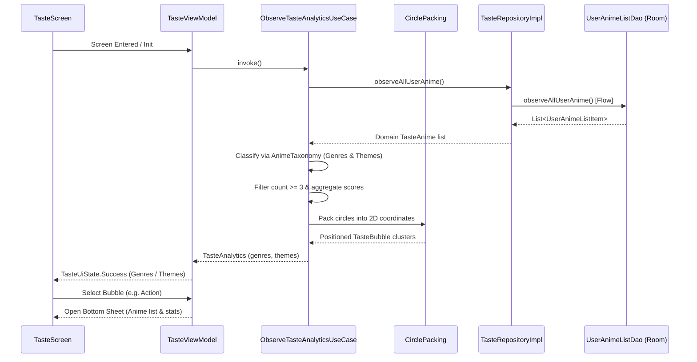

# Feature 03: Anime Taste Analytics (Packed Bubble Chart)

## Overview
This feature introduces the "My Taste" screen, providing visual analytics of the user's anime preferences via interactive, packed bubble charts. It maps genre and theme frequencies across the user's saved anime collection with area-proportional circle scaling, dynamic multi-touch gestures (pan & zoom), taxonomy classification, accessible theming following `docs/DESIGN.md`, and an interactive bottom sheet exploring matching anime entries.

---

## Key Requirements & Agreed Design

1. **Reactive, Offline-First Observation**:
   - Observes the user's list from Room DB (`user_anime_list` joined with `animes`) via `UserAnimeListDao.observeAllUserAnime()`.
   - All watch statuses (`watching`, `completed`, `on_hold`, `dropped`, `plan_to_watch`) are included by default to reflect overall taste.
   - Decoupled from network sync operations; does not trigger background syncs directly.

2. **Taxonomy & Classification (`:core:domain`)**:
   - The MAL API bundles demographics, themes, and tropes under the generic `genres` array.
   - Centralized taxonomy constants:
     - `GENRE_NAMES`: High-level genres (Action, Adventure, Comedy, Drama, Fantasy, Romance, Sci-Fi, etc.).
     - `THEME_NAMES`: Demographics (Kids, Seinen, Shoujo, Shounen) and Themes/Tropes (Isekai, Mecha, Psychological, School, Super Power, etc.).
   - Classification extension functions split `GenreEntity` items into `genres` and `themes`.
   - Items not matching either set default to `theme` with an explicit `// TODO: Log unclassified genre/theme tag` comment for future crashlytics/logging integration.

3. **Analytics & Thresholding**:
   - Counts occurrences of each genre and theme across the user's anime list.
   - Frequency threshold: Excludes any genre or theme with `count < 3` to hide isolated edge cases.
   - Bubble sizing: Area-proportional square-root scaling ($r \propto \sqrt{\text{count}}$) clamped between `36.dp` and `88.dp` so popular genres are prominent without overwhelming smaller ones.

4. **Deterministic Circle Packing Algorithm**:
   - Front-chain / tangent packing algorithm in pure Kotlin:
     - Sorts bubbles descending by radius.
     - Places largest bubble at origin $(0, 0)$.
     - Compactly arranges subsequent bubbles tangent to existing outer-boundary circles, minimizing distance to center without overlaps.
   - Fully deterministic, unit-testable, executes in $<5\text{ ms}$, ensuring zero frame drops and preview stability.

5. **Soft & Modern Theming (`:core:ui`)**:
   - 15 curated semantic color pairs meeting WCAG AA contrast ($\ge 4.5:1$):
     - Light Mode: Soft pastel container fills with deep, legible text.
     - Dark Mode: Rich muted tonal containers with high-contrast light text.
   - Colors are assigned deterministically and cycled when categories exceed palette size.

6. **Canvas Interaction & Gestures**:
   - Custom Jetpack Compose `Canvas` rendering circles, labels, and count text.
   - Multi-touch gesture handling: Pan and pinch-to-zoom (`detectTransformGestures`) with bounded scale ($0.6x$ to $3.5x$).
   - Centered Segmented Button / Pill Toggle ("Genres" vs "Themes") at the top.
   - Switching types automatically resets zoom and centers the cluster.
   - Floating "Re-center" action button appears when panned or zoomed away from default.

7. **Interactive Detail Bottom Sheet**:
   - Tapping any bubble highlights it and opens an accessible Modal Bottom Sheet.
   - Header: Category name, total count of matching anime, and average user score.
   - Content: Scrollable list of anime cards showing poster thumbnail, title, user rating, and semantic watch status chip.

8. **Empty States**:
   - User list empty: Prompts user that their anime list is empty.
   - No genre/theme $\ge 3$: Informs user that at least 3 anime of a genre or theme are needed to unlock its bubble.

---

## Architectural Breakdown

```
:feature:taste/
├── data/
│   └── repository/
│       └── TasteRepositoryImpl.kt
├── domain/
│   ├── algorithm/
│   │   └── CirclePacking.kt
│   ├── model/
│   │   ├── TasteBubble.kt
│   │   ├── TasteAnimeItem.kt
│   │   ├── TasteCategorySummary.kt
│   │   └── TasteType.kt (GENRE, THEME)
│   ├── repository/
│   │   └── TasteRepository.kt
│   └── usecase/
│       └── ObserveTasteAnalyticsUseCase.kt
├── presentation/
│   ├── TasteScreen.kt
│   ├── TasteViewModel.kt
│   ├── TasteUiState.kt
│   ├── TasteUiEvent.kt
│   ├── TasteUiStatePreviewParameterProvider.kt
│   └── components/
│       ├── PackedBubbleChart.kt
│       ├── TasteTypeSelector.kt
│       ├── TasteBottomSheet.kt
│       └── TasteEmptyState.kt
└── di/
    └── TasteModule.kt

:core:domain/
└── taxonomy/
    └── AnimeTaxonomy.kt

:core:ui/
└── theme/
    └── TasteColors.kt
```

---

## Data Flow


