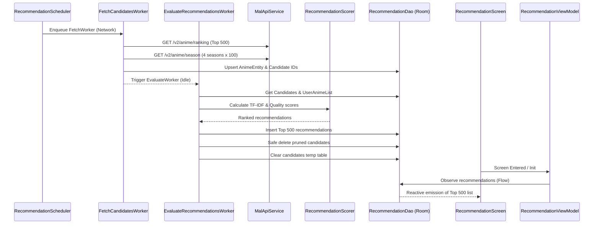

# Feature 04: Smart Recommendation Engine & Screen

## Overview
This feature introduces the personalized recommendation engine and the Recommendation tab in the MyAnimeList client. It coordinates a two-stage background `WorkManager` pipeline (fetching top all-time and seasonal anime, followed by a TF-IDF taste evaluation against the user's personal anime list) and displays the top 500 recommendations categorized by Genre and Theme in a "Soft & Modern" Jetpack Compose UI adhering to `docs/DESIGN.md`.

---

## Key Requirements & Agreed Design

1. **Two-Stage WorkManager Pipeline**:
   - **Stage 1 (`FetchCandidatesWorker`)**:
     - Constraints: `NetworkType.CONNECTED`.
     - Fetches 500 all-time top anime via `GET /v2/anime/ranking?ranking_type=all&limit=500`.
     - Fetches 100 top anime by popularity (`anime_num_list_users`) across 4 seasons: Current season, Next season, Last season, and Two seasons ago via `GET /v2/anime/season/{year}/{season}?limit=100&sort=anime_num_list_users`.
     - Filters out anime already present in the user's list (`user_anime_list`).
     - Inserts candidate entities into `animes` and records their IDs into `recommendation_candidates`.
   - **Stage 2 (`EvaluateRecommendationsWorker`)**:
     - Constraints: Device Idle (`setRequiresDeviceIdle(true)`) for background periodic runs; relaxed when triggered manually by user.
     - Evaluates candidate anime using the TF-IDF taste weighting × global quality score formula.
     - Saves evaluated recommendations into `recommendations`.
     - Prunes discarded candidates (those with `genre_rank > 500 AND theme_rank > 500`) from `animes` table using a safe delete query (`WHERE id IN (:discardedIds) AND id NOT IN (SELECT anime_id FROM user_anime_list)`).
     - Clears the temporary `recommendation_candidates` table.

2. **Scheduling & Triggers**:
   - **Lazy Initial Scheduling**: Automatically enqueued as a `OneTimeWorkRequest` when the recommendation screen is opened if no recommendations exist yet and the user list has $\ge 5$ anime (using `ExistingWorkPolicy.KEEP` to avoid duplicate work). Later user list changes remain until the user manually recalculates.
   - **Periodic Trigger**: Recurring schedule every 90 days (`PeriodicWorkRequestBuilder(90, TimeUnit.DAYS)`).
   - **Manual Refresh**: "Recalculate" action on the screen allows forcing immediate re-evaluation.

3. **Scoring Algorithm (TF-IDF & Quality Normalization)**:
   - Partitions tags using `AnimeTaxonomy` into Genres and Themes.
   - **Term Frequency (TF)**: Frequency of genre/theme in user's list, weighted by user rating when scored.
   - **Inverse Document Frequency (IDF)**: $\log\left(\frac{N}{\text{candidate\_count}(tag) + 1}\right)$ to dampen ubiquitous tags (Action, Shounen) and boost niche tags (School, Organized Crime).
   - **Quality Multiplier**: Scaled by MAL global score (`meanScore / 10.0`) and logarithmic popularity factor ($\log_{10}(\text{numListUsers})$).
   - Computes `genre_score`, `genre_rank`, `theme_score`, `theme_rank`, and 0–100% Match Percentage.

4. **Database Architecture (`:core:database`)**:
   - `RecommendationEntity`: Stores `anime_id`, `genre_score`, `genre_rank`, `theme_score`, `theme_rank`, `genre_match_percent`, `theme_match_percent`, and `calculated_at`.
   - `RecommendationCandidateEntity`: Temp table storing candidate `anime_id` and `source`.
   - `RecommendationItem`: Embedded relation joining `RecommendationEntity` with `AnimeEntity`.
   - `RecommendationDao`: Room queries and atomic transactions for candidate management, scoring inserts, and safe pruning.
   - Room migration `MIGRATION_2_3`.

5. **UI & Presentation (`:feature:recommendation`)**:
   - "Soft & Modern" design language matching `docs/DESIGN.md`.
   - Centered pill switch ("Genres" vs "Themes").
   - Recommendation anime cards displaying:
     - Poster thumbnail (`2:3` aspect ratio).
     - Rank badge (`#1`, `#2`, etc.).
     - Match percentage chip (`96% Match`).
     - MAL score badge (`★ 8.4`).
     - Media type, episode count, and release season tags.
   - UI States:
     - `EmptyInsufficientData`: Prompts user to add at least 5 anime to My List.
     - `Calculating`: Informs user that recommendations are processing in background, with a "Calculate Now" CTA.
     - `Success`: Displays Top 500 recommendations with localized plurals count header.

---

## Architectural Breakdown

```
:feature:recommendation/
├── data/
│   ├── remote/
│   │   ├── RecommendationRemoteDataSource.kt
│   │   └── RecommendationRemoteDataSourceImpl.kt
│   ├── repository/
│   │   └── RecommendationRepositoryImpl.kt
│   └── work/
│       ├── FetchCandidatesWorker.kt
│       ├── EvaluateRecommendationsWorker.kt
│       └── RecommendationScheduler.kt
├── domain/
│   ├── algorithm/
│   │   └── RecommendationScorer.kt
│   ├── model/
│   │   ├── RecommendedAnime.kt
│   │   ├── RecommendationType.kt
│   │   └── RecommendationState.kt
│   ├── repository/
│   │   └── RecommendationRepository.kt
│   └── usecase/
│       ├── ObserveRecommendationsUseCase.kt
│       ├── ObserveRecommendationStateUseCase.kt
│       └── TriggerRecommendationCalculationUseCase.kt
├── presentation/
│   ├── RecommendationScreen.kt
│   ├── RecommendationViewModel.kt
│   ├── RecommendationUiState.kt
│   ├── RecommendationUiEvent.kt
│   ├── RecommendationUiStatePreviewParameterProvider.kt
│   └── components/
│       ├── RecommendationCard.kt
│       ├── RecommendationPillSelector.kt
│       ├── RecommendationEmptyState.kt
│       └── RecommendationHeader.kt
└── di/
    └── RecommendationModule.kt

:core:database/
├── dao/
│   └── RecommendationDao.kt
├── entity/
│   ├── RecommendationEntity.kt
│   └── RecommendationCandidateEntity.kt
└── model/
    └── RecommendationItem.kt
```

---

## Data Flow


