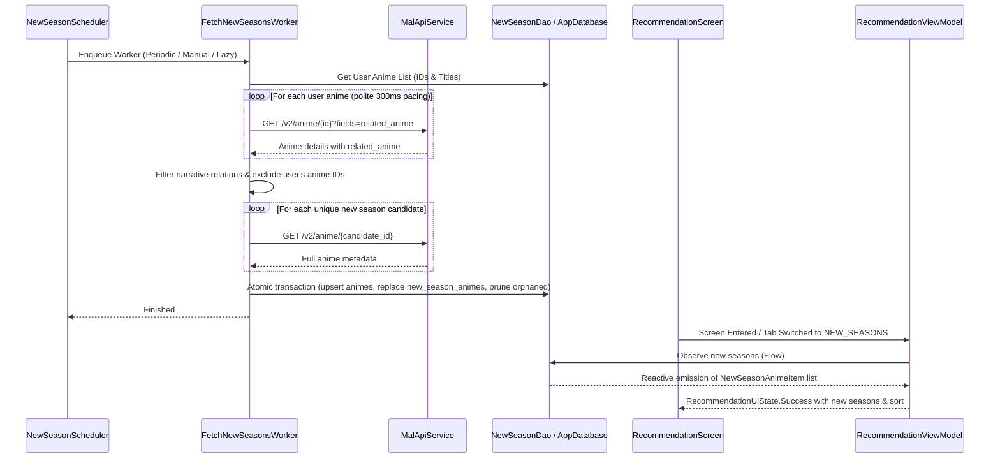

# Feature 05: New Seasons of User's Anime (Recommendation 3rd Pill Option)

## Overview
This feature introduces a "New Seasons" option as the 3rd pill switch on the existing Recommendation screen (`Genres` | `Themes` | `New Seasons`). It automatically discovers sequels, prequels, spin-offs, and side stories for anime already in the user's personal anime list using the official MyAnimeList details API (`GET /v2/anime/{anime_id}?fields=related_anime`).

Suggestions are fetched periodically every 30 days when the device is connected to the internet and idle via `WorkManager`, or immediately on first screen visit / manual user recalculation. Candidates already present in the user's list are filtered out, full metadata is fetched for unique candidates, and results are safely stored in Room (`new_season_animes`). In addition, the recommendation candidate pipeline is updated to ignore new season anime so that genre/theme recommendations remain focused purely on novel discoveries.

---

## Key Requirements & Agreed Design

1. **Relation Types Considered**:
   All narrative relation types from MAL's `related_anime` field:
   - `sequel`
   - `prequel`
   - `side_story`
   - `parent_story`
   - `spin_off`
   - `alternative_setting`
   - `alternative_version`
   - `full_story`
   (excluding non-narrative / recap types like `summary` or `other`).

2. **Metadata Enrichment**:
   The `related_anime` node only returns basic info (`id`, `title`, `main_picture`). For each unique candidate not already in `user_anime_list`, full details are retrieved via `GET /v2/anime/{id}` so cards feature rich metadata matching My List:
   - MAL score (`meanScore`)
   - Airing status (`airingStatus`)
   - Release season (`startSeasonYear`, `startSeasonSeason`)
   - Total episodes (`numEpisodes`)
   - Media type (`mediaType`)

3. **Contextual Connection**:
   The `new_season_animes` table stores `parent_anime_id`, `relation_type`, and `relation_type_formatted`, allowing UI cards to render badges like *"Sequel to Attack on Titan"*.

4. **Background Pipeline (`FetchNewSeasonsWorker`)**:
   - Single cohesive Hilt `CoroutineWorker`.
   - Fetches related anime for all entries in `user_anime_list` with polite request pacing (300ms delay) to respect MAL rate limits.
   - Retrieves full details for discovered unique candidates.
   - Atomically updates Room: clears `new_season_animes`, upserts anime entities, inserts new relations, and safely deletes pruned candidates not referenced by `user_anime_list` or `recommendations`.
   - Minimum user list threshold: 5 anime.

5. **Mutual Candidate Isolation**:
   - `FetchCandidatesWorker` filters candidates against both `user_anime_list` and `new_season_animes`.
   - Candidate pruning in `RecommendationDao` protects both `user_anime_list` and `new_season_animes` from deletion.

6. **Scheduling & Triggers (`NewSeasonScheduler`)**:
   - Recurring 30-day periodic work (`PeriodicWorkRequestBuilder(30, TimeUnit.DAYS)`) with `NetworkType.CONNECTED` and `setRequiresDeviceIdle(true)`.
   - Lazy initial calculation on screen visit if `new_season_animes` is empty and user has $\ge 5$ anime.
   - Immediate manual recalculation via the header refresh button (bypassing the idle constraint).

7. **UI & Presentation (`:feature:recommendation`)**:
   - 3-segmented button pill switch: `Genres`, `Themes`, `New Seasons`.
   - Dedicated `NewSeasonCard` component adhering to `docs/DESIGN.md` with:
     - 2:3 aspect ratio poster thumbnail.
     - Title and optional subtitle.
     - Media type, release season, and airing status chips.
     - Score badge and episode count.
     - Contextual parent badge (*"Sequel to [Title]"*).
   - Interactive Sort Dropdown in header: Release Date (default), Score Descending, Title Ascending.
   - Distinct UI states:
     - `Loading`: Progress indicator.
     - `Calculating`: Informs user that search is running in background with manual refresh action.
     - `EmptyInsufficientData`: Prompts user to add at least 5 anime to My List.
     - `EmptyAllCaughtUp`: "You're all caught up! No new seasons found for your anime."
     - `Success`: Displays new season cards with plurals count header and sort dropdown.

---

## Architectural Breakdown

```
:feature:recommendation/
├── data/
│   ├── mapper/
│   │   └── NewSeasonMapper.kt
│   ├── remote/
│   │   └── (Uses MalApiService)
│   ├── repository/
│   │   └── NewSeasonRepositoryImpl.kt
│   └── work/
│       ├── FetchNewSeasonsWorker.kt
│       └── NewSeasonScheduler.kt
├── domain/
│   ├── model/
│   │   ├── NewSeasonAnime.kt
│   │   ├── NewSeasonSortOption.kt
│   │   ├── NewSeasonState.kt
│   │   └── RecommendationType.kt (extended)
│   ├── repository/
│   │   └── NewSeasonRepository.kt
│   └── usecase/
│       ├── ObserveNewSeasonsUseCase.kt
│       ├── ObserveNewSeasonStateUseCase.kt
│       ├── ScheduleNewSeasonWorkUseCase.kt
│       └── TriggerNewSeasonCalculationUseCase.kt
├── presentation/
│   ├── RecommendationScreen.kt
│   ├── RecommendationViewModel.kt
│   ├── RecommendationUiState.kt
│   ├── RecommendationUiEvent.kt
│   └── components/
│       ├── NewSeasonCard.kt
│       ├── RecommendationPillSelector.kt
│       └── RecommendationHeader.kt
└── di/
    └── RecommendationModule.kt

:core:database/
├── dao/
│   ├── NewSeasonDao.kt
│   └── RecommendationDao.kt (updated pruning)
├── entity/
│   └── NewSeasonAnimeEntity.kt
├── model/
│   └── NewSeasonAnimeItem.kt
└── AppDatabase.kt (v4 with MIGRATION_3_4)

:core:network/
├── api/
│   └── MalApiService.kt (getAnimeDetails)
└── model/
    └── MalAnimeListDtos.kt (AnimeDetailsDto, RelatedAnimeEdgeDto)
```

---

## Data Flow


